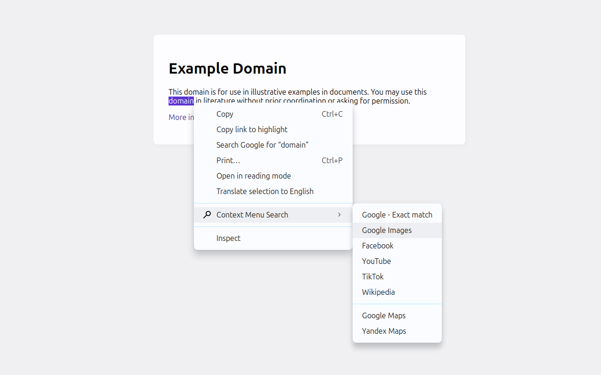
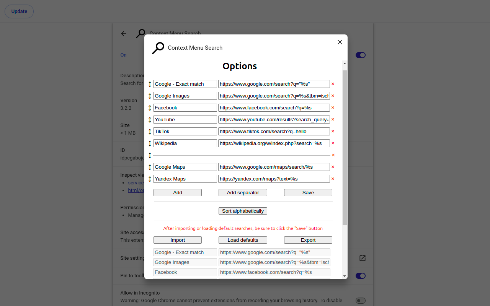

# [Context Menu Search](https://chromewebstore.google.com/detail/idpcgabojogahgmhdgnjkmdliaeeofka)

- [Chrome Web Store](https://chromewebstore.google.com/detail/idpcgabojogahgmhdgnjkmdliaeeofka)
- [Installation for developers (for Linux users)](#installation-for-developers-for-linux-users)
- [Sources](#sources)
    - [Icons](#icons)

## Installation for developers (for Linux users)

1. Go to the `chrome://extensions`.
2. Enable `Developer mode` checkbox.
3. Click on the `Load unpacked` button.
4. Select the extension directory.

## Sources

### Icons

- [Search, zoom icon](https://iconfinder.com/icons/171427/search_zoom_icon)
